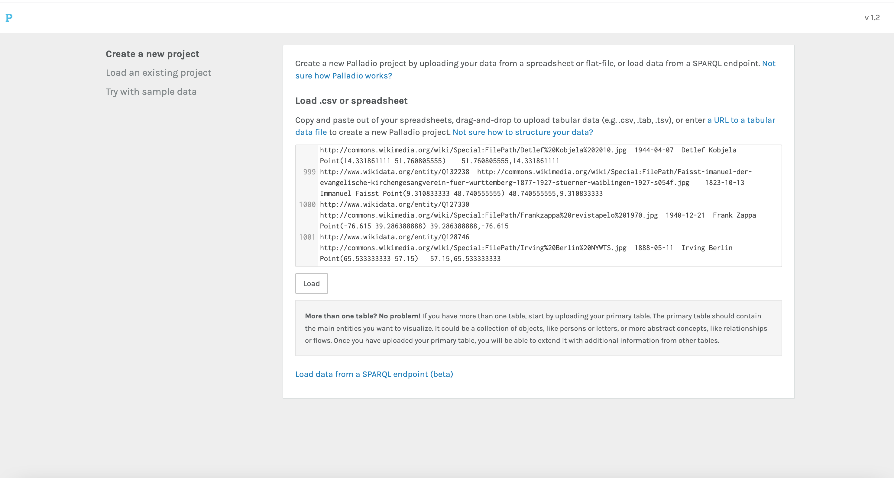
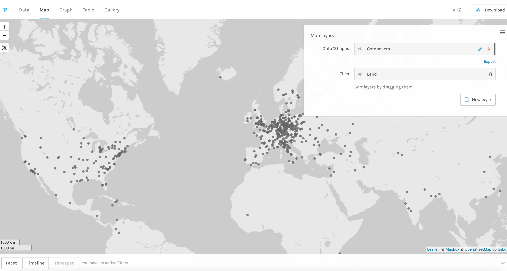
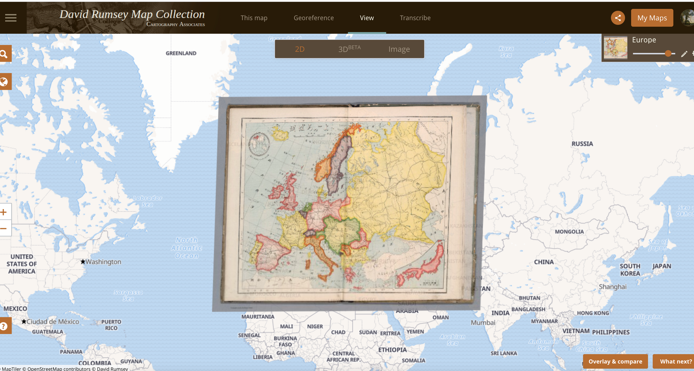
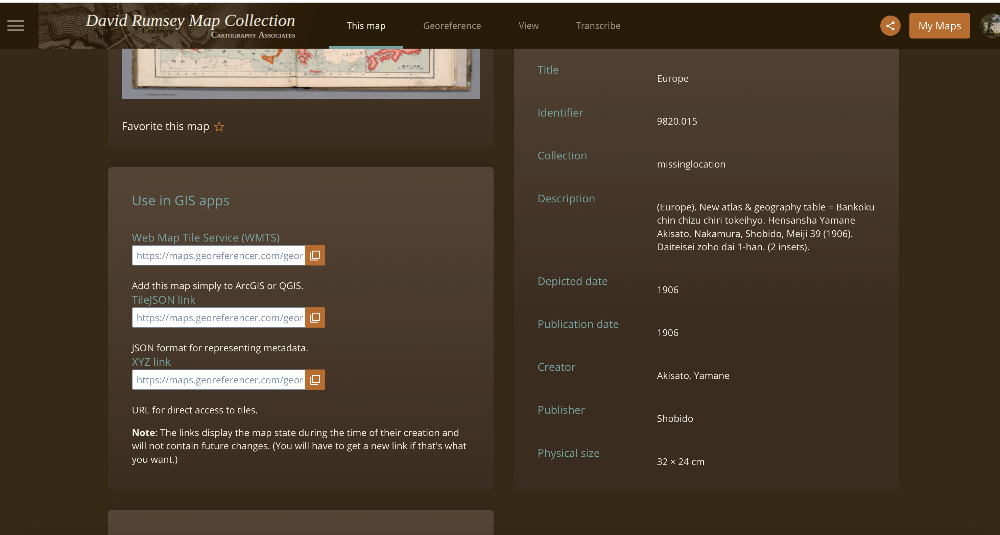
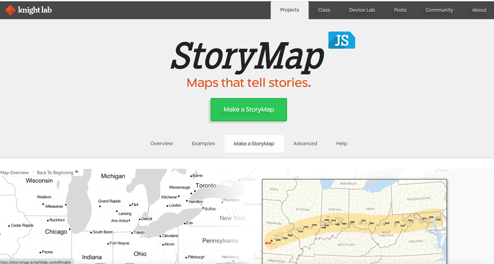
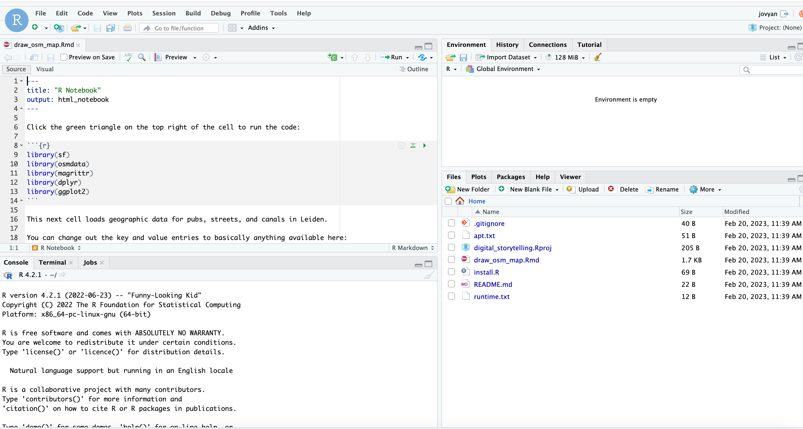

Today you can choose from three options, representing different approaches to mapping:

1.  Map some data using Palladio

2.  Make a 'StoryMap'

3.  Work with the Open Street Map (involves some coding)

For 3, you'll need to open a coding notebook. Bear in mind that these can be a bit temperamental, so be prepared to be patient or for it not to work at all. If you don't have coding experience, it might be nice to try out to get a feel for it, but making any changes or adding your own data may be slightly frustrating.

## Map Using Palladio

In this method, we'll use a tool called Palladio, which was specifically made to work with humanities data. There are a number of very good tutorials for using Palladio, particularly <https://miriamposner.com/blog/getting-started-with-palladio/>.

First, go to <http://hdlab.stanford.edu/palladio/> and click 'start'. This is where you can load your own data in .csv format.

You can use any .csv data. **To make a map, the application needs data with a single column with the latitude and longitude coordinates, separated by a comma.**

Load some sample data I have prepared here: https://docs.google.com/spreadsheets/d/17_enwtCIHfqrTyUhV-WnAEqKiYevEkU6-NW0mlE0Er0/edit?usp=sharing

This contains 1,000 individuals tagged as 'composer' in Wikipedia. This data is relatively simple to get from a service called Wikidata - **if you think you'd like to use some kind of geographic data like this in your portfolio, get in touch with me!**

Click 'start' on Palladio, and copy this data into the large text box on the next screen:

Click 'load'.

Click on the map tab at the top of the screen:

Next, create a 'layer', which will allow us to draw points of data on top of the map. Click 'new layer' and give it a name:

Next, tell Palladio which data to use to draw points on the map. Click on the 'Places' box which will give a drop-down of all the fields in the data with geographic coordinates. Click on the first one, 'coordinates'.

We also want the name of the individual to appear when you hover over the point. To do this, change the 'Tooltip' option to 'itemLabel'.

Experiment with changing the point colour, and choosing to size by something in your data.

Click 'Add layer' to create the points on your map. You've just created a basic interactive map, congratulations! You can move the map around by clicking and dragging, and hovering over a point will display the relevant data.

## Add a map layer

As an optional step, you can change or add different background maps to your Palladio map, for example one containing modern roads and cities, or a historic map.

To do this, click on 'New Layer' again. This time, click on the 'Tiles' tab. You can select an existing tileset here, or add your own using the 'Custom tiles' option.

To add custom tiles, you need the appropriate 'Tileset URL'. One place to find these is a resource called *David Rumsey Maps*. Go to https://rumsey.mapranksearch.com/, and find a map you are interested in on the right hand side. Click into the map, and then on the thumbnail of it on the bottom-right of the screen. Click 'This map' on the next screen:

Finally, you'll need to make a free account on David Rumsey maps, or log in through Google. Once this is done you'll see three text boxes. Copy and paste the text from the final one (XYZ link), and paste this into the 'Titleset URL' box on Palladio, and click 'add layer':

Once you are finished, take a screenshot of your map, write a 200-300 word description, create a .pdf with the screenshot and description, and upload to the assignment on Brightspace.

## Make a StoryMap

The tool we're going to use is called StoryMap JS. It's quite straightforward to use, so the challenge will be to find a story which has a number of geographic locations related to it. You could choose an event in history, a recent news event which took place in several locations, or something else entirely.

To begin with, go to https://storymap.knightlab.com/ and click on 'Make a StoryMap'.

It will ask you to log in with a Google account - there's no way around this unfortunately.

Once logged in, create a new map.

Before you begin, check out the 'options' at the top of the page. Most are self-explanatory, but one to note is 'Treat as:', which can be either 'image' or 'cartography'. For our purposes, the only difference is that with 'image' selected, there will not be a line drawn between points on the map.

The starting slide is a special slide which will show all the points from your subsequent slides. Add a headline and text, or an image which represents your map as a whole. Use 'preview' at the top of the map to see what it will look like to the user.

Once you're happy, add a new slide. Again, you can give it a name, add text, or add an image or even a youtube video as a URL. Next, you want to associate the slide with a geographic location. To do this, use the text box at the bottom of the map. You can either add coordinates directly (these can be found easily using Google maps, ask me if you're not sure), or you can search for a place. Search for a location, for example 'Paris'. Click on the correct one, making sure that you don't select another place with the same name. To add coordinates, enter in the format as specified in the text box.

Continue until you have finished with your slides, and check how it looks using the Preview.

Make sure to save your work, and when you're finished, click 'share'. Copy the URL into a .pdf, along with a short description of your map and the motivation behind it, and upload to the relevant area on Brightspace.

## Create a map using the programming language R.

For this, you need to run a coding notebook through a service called MyBinder. To load the notebook, click the button below:

Once this loads (it might take a few minutes), you'll see a coding notebook. Be prepared to have one of the other tutorials as plan B, as sometimes this service doesn't work!

Another important thing to note is that Binder doesn't save your data - in fact, if it is idle for ten minutes, it will be deleted. So if you make lots of changes or if you want to download your output, make sure you do so as soon as possible.

After a wait, you'll be greeted with a new interface. To open the code notebook we're going to use, look at the file lists on the bottom-right of the screen, and click on the file 'draw_osm_map.Rmd.

The notebook is divided into 'cells'. Each cell contains some code. Run the cell by clicking the small triangle on the top right. The code will run and the results (if any) will display underneath the cell.

The first cell loads some libraries (packages of code) needed.

The next cell downloads data from Open Street Map. Open street map contains thousands of types of data, from roads and rivers to amenities such as bars and restaurants. You can use a coding language to access this and draw a map.

Here I have downloaded all places marked as a pub within the centre of Leiden. To do so, first we specify a 'bounding box', which tells the code to only download data from within a certain area on the map. Next, we specify what type of data, first general ('amenity') and then specific ('pub'). Then do the same to get residential streets, and canals.

Next are a couple of tricks to get the actual geographic data (points and lines), but it's not worth going into the details.

Once you run this cell, it will download all the relevant data.

The final cell turns it into a simple map. We add each of the data points as layers to the map. When you run the cell, you'll see the map underneath.

**The fun thing is that now you can try swapping in different data points to download, and even try with another city. For the former, the full list is available here: https://wiki.openstreetmap.org/wiki/Map_features**

To use another city, you'll need to get the correct coordinates for the box it is contained within. You can use a bounding box tool, and then copy this into the first part of the command. **Note that if you choose a very big area, it might struggle to download the data.**

Once you have finished your map, save it using 'right click-\> save image as' in your browser. Copy into a .pdf, write a 200-300 word description of your map and what it shows, and upload to the relevant assignment on Brightspace.
